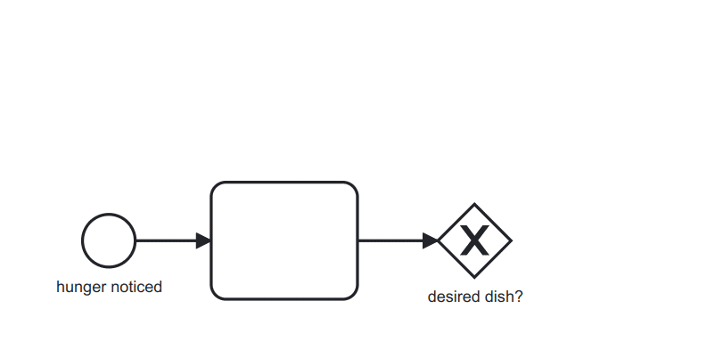

# bpmn-js - BPMN 2.0 for the web

[](https://travis-ci.org/bpmn-io/bpmn-js)

View and edit BPMN 2.0 diagrams in the browser.

[](http://demo.bpmn.io/s/start)


## Installation

Use the library [pre-packaged](https://github.com/bpmn-io/bpmn-js-examples/tree/master/pre-packaged)
or include it [via npm](https://github.com/bpmn-io/bpmn-js-examples/tree/master/bundling)
into your node-style web-application.

## Usage

To get started, create a [bpmn-js](https://github.com/bpmn-io/bpmn-js) instance
and render [BPMN 2.0 diagrams](https://www.omg.org/spec/BPMN/2.0.2/) in the browser:

```javascript
var xml; // my BPMN 2.0 xml
var viewer = new BpmnJS({
  container: 'body'
});

viewer.importXML(xml, function(err) {

  if (err) {
    console.log('error rendering', err);
  } else {
    console.log('rendered');
  }
});
```

Checkout our [examples](https://github.com/bpmn-io/bpmn-js-examples) for many
more supported usage scenarios.


### Dynamic Attach/Detach

You may attach or detach the viewer dynamically to any element on the page, too:

```javascript
var viewer = new BpmnJS();

// attach it to some element
viewer.attachTo('#container');

// detach the panel
viewer.detach();
```


## Resources

* [Demo](http://demo.bpmn.io)
* [Issues](https://github.com/bpmn-io/bpmn-js/issues)
* [Examples](https://github.com/bpmn-io/bpmn-js-examples)
* [Forum](https://forum.bpmn.io)
* [Changelog](./CHANGELOG.md)


## Building the Project

Perform the following steps to build the library, including running all tests:

```
cd bpmn-js
npm install
npm run all
```

You may need to perform [additional project setup](./docs/project/SETUP.md) when
building the latest development snapshot.

Please checkout our [contributing guidelines](./.github/CONTRIBUTING.md) if you plan to
file an issue or pull request.


## Related

bpmn-js builds on top of a few additional powerful tools:

* [bpmn-moddle](https://github.com/bpmn-io/bpmn-moddle): Read / write support for BPMN 2.0 XML in the browsers
* [diagram-js](https://github.com/bpmn-io/diagram-js): Diagram rendering and editing toolkit


## License

Use under the terms of the [bpmn.io license](http://bpmn.io/license).
