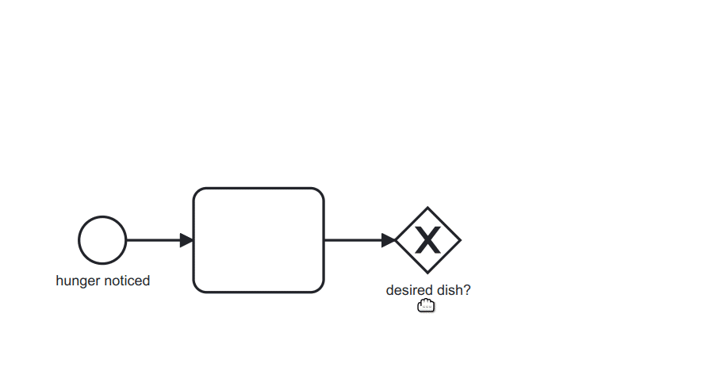

# bpmn-js - BPMN 2.0 for the web

[](https://github.com/bpmn-io/bpmn-js/actions?query=workflow%3ACI)

View and edit BPMN 2.0 diagrams in the browser.

[](http://demo.bpmn.io/s/start)

## Installation

Use the library [pre-packaged](https://github.com/bpmn-io/bpmn-js-examples/tree/master/pre-packaged)
or include it [via npm](https://github.com/bpmn-io/bpmn-js-examples/tree/master/bundling)
into your node-style web-application.

## Usage

To get started, create a [bpmn-js](https://github.com/bpmn-io/bpmn-js) instance
and render [BPMN 2.0 diagrams](https://www.omg.org/spec/BPMN/2.0.2/) in the browser:

```javascript
const xml = '...'; // my BPMN 2.0 xml
const viewer = new BpmnJS({
  container: 'body'
});

try {
  const { warnings } = await viewer.importXML(xml);

  console.log('rendered');
} catch (err) {
  console.log('error rendering', err);
}
```

Checkout our [examples](https://github.com/bpmn-io/bpmn-js-examples) for many
more supported usage scenarios.

### Dynamic Attach/Detach

You may attach or detach the viewer dynamically to any element on the page, too:

```javascript
const viewer = new BpmnJS();

// attach it to some element
viewer.attachTo('#container');

// detach the panel
viewer.detach();
```

## Resources

* [Demo](http://demo.bpmn.io)
* [Issues](https://github.com/bpmn-io/bpmn-js/issues)
* [Examples](https://github.com/bpmn-io/bpmn-js-examples)
* [Forum](https://forum.bpmn.io)
* [Changelog](./CHANGELOG.md)

## Build and Run

Prepare the project by installing all dependencies:

```sh
npm install
```

Then, depending on your use-case you may run any of the following commands:

```sh
# build the library and run all tests
npm run all

# spin up a single local modeler instance
npm start

# run the full development setup
npm run dev
```

You may need to perform [additional project setup](./docs/project/SETUP.md) when
building the latest development snapshot.

## Related

bpmn-js builds on top of a few powerful tools:

* [bpmn-moddle](https://github.com/bpmn-io/bpmn-moddle): Read / write support for BPMN 2.0 XML in the browsers
* [diagram-js](https://github.com/bpmn-io/diagram-js): Diagram rendering and editing toolkit

## Contributing

Please checkout our [contributing guidelines](./.github/CONTRIBUTING.md) if you plan to
file an issue or pull request.

## Code of Conduct

By participating to this project, please uphold to our [Code of Conduct](https://github.com/bpmn-io/.github/blob/master/.github/CODE_OF_CONDUCT.md).

## License

Use under the terms of the [bpmn.io license](http://bpmn.io/license).
